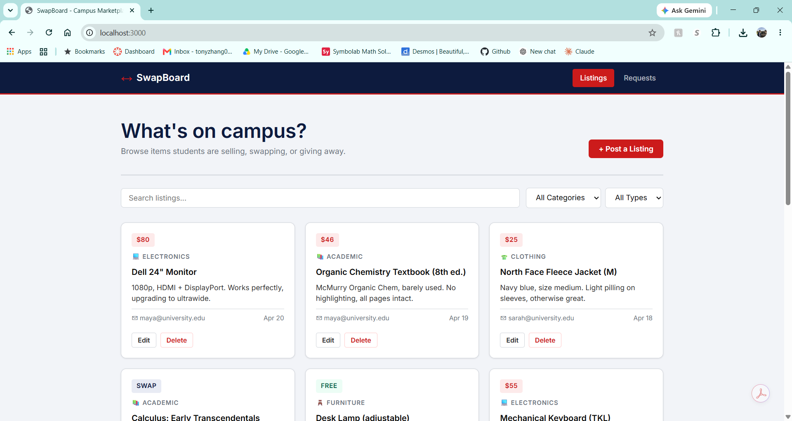

# SwapBoard

A campus marketplace where students buy, sell, swap, and request everyday items: textbooks, furniture, clothes, and electronics.

Authors: Tony Zhang, Celine Isaacs
<<<<<<< HEAD
Course:** CS5610 Web Development, 
Northeastern University 
([class link](https://northeastern.instructure.com/courses/249954))
=======
Course:** CS5610 Web Development, Northeastern University ([class link](https://northeastern.instructure.com/courses/249954))
>>>>>>> 851fc0784c262272e270c26b981438d654daaefb


Live Site:[https://swapboard.onrender.com](https://swapboard.onrender.com)
Demo Video: [https://youtu.be/jDgG5kHXXsk](https://youtu.be/jDgG5kHXXsk)
<<<<<<< HEAD
Design mockups  found in the [design-mockups](./design-mockups) folder
Design Document: [DESIGN.md](./DESIGN.md)
=======
Design mockups  found in the [design-mockups](./design-mockups) folder.
>>>>>>> 851fc0784c262272e270c26b981438d654daaefb



## Tech Stack

- Frontend: vanilla JavaScript (ES6 modules), HTML, CSS
- Backend: Node.js + Express (ESM)
- Database: MongoDB (native driver)
- Data requests: Fetch API

## Setup

Prerequisites: Node 18+ and MongoDB on `mongodb://localhost:27017` (or set `MONGO_URI` for Atlas).

```bash
cd files
npm install
npm run seed     # loads sample listings and requests
npm start        # or: npm run dev  (auto-reload)
```

Open http://localhost:3000.

## Project Structure

```
SwapBoard/
├── files/
│   ├── backend/
│   │   ├── db/connection.js        # MongoDB connection
│   │   ├── routes/listings.js      # CRUD + filter for listings
│   │   ├── routes/requests.js      # CRUD + fulfill for requests
│   │   ├── seed.js                 # database seed script
│   │   └── server.js               # Express entry point
│   ├── frontend/
│   │   ├── index.html              # Listings page
│   │   ├── requests.html           # Requests page
│   │   ├── js/api.js               # Fetch client (listings + requests)
│   │   ├── js/utils.js             # shared helpers, modal, toast
│   │   ├── pages/listings.js       # Listings page logic
│   │   ├── pages/requests.js       # Requests page logic
│   │   └── styles/                 # modular CSS
│   │       ├── tokens.css
│   │       ├── header.css
│   │       ├── layout.css
│   │       ├── cards.css
│   │       ├── buttons.css
│   │       ├── modal.css
│   │       ├── forms.css
│   │       └── utilities.css
│   ├── eslint.config.js
│   ├── .gitignore
│   └── package.json
├── README.md
├── LICENSE
└── screenshot.png
```

## API

### Listings — `/api/listings`

| Method | Path | Description |
|--------|------|-------------|
| GET | `/api/listings` | All listings. Query: `?category=` `?type=` `?q=` |
| GET | `/api/listings/:id` | One listing |
| POST | `/api/listings` | Create |
| PATCH | `/api/listings/:id` | Edit |
| DELETE | `/api/listings/:id` | Delete |

Fields: `title`*, `category`*, `type`* (sell/swap/free), `price` (if sell), `description`, `contact`*.
Categories: Academic, Furniture, Clothing, Electronics, Other.

### Requests — `/api/requests`

| Method | Path | Description |
|--------|------|-------------|
| GET | `/api/requests` | Open requests. Query: `?category=` `?showFulfilled=true` |
| GET | `/api/requests/:id` | One request |
| POST | `/api/requests` | Create |
| PATCH | `/api/requests/:id` | Edit, or set `fulfilled: true` |
| DELETE | `/api/requests/:id` | Delete |

Fields: `title`*, `category`*, `budget`, `description`, `contact`*, `fulfilled`.

## Technical Independence

The `listings` and `requests` collections are fully independent. Each defines its own copy of the category list, has its own router and validation, and neither imports from the other.

The `listings` and `requests` collections are fully independent. Each has its own router, validation, data shape, and copy of the category list, and neither imports from the other.
